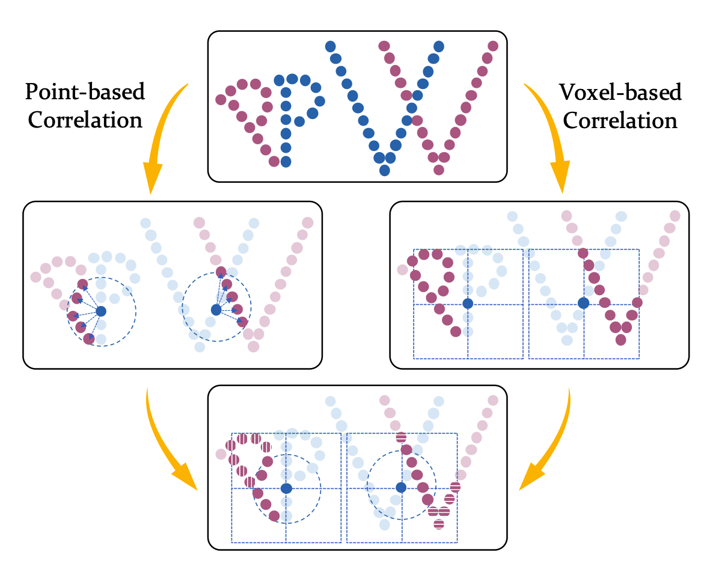

PV-RAFT
===

This repository contains the PyTorch implementation for paper [PV-RAFT: Point-Voxel Correlation Fields for Scene Flow Estimation of Point Clouds](https://arxiv.org/abs/2012.00987) (CVPR 2021)


## Installation

### Prerequisites
- Python 3.8
- PyTorch 1.8
- torch-scatter
- CUDA 10.2
- RTX 2080 Ti
- tqdm, tensorboard, scipy, imageio, png

```Shell
conda create -n pvraft python=3.8
conda install pytorch torchvision torchaudio cudatoolkit=10.2 -c pytorch
conda install tqdm tensorboard scipy imageio
pip install pypng
pip install torch-scatter -f https://pytorch-geometric.com/whl/torch-1.8.0+cu102.html
```

## Usage

### Data Preparation
We follow [HPLFlowNet](https://web.cs.ucdavis.edu/~yjlee/projects/cvpr2019-HPLFlowNet.pdf) to prepare FlyingThings3D and KITTI datasets. Please refer to [repo](https://github.com/laoreja/HPLFlowNet). Make sure the project structure look like this:
```Shell
RAFT_SceneFlow/
    data/
        FlyingThings3D_subset_processed_35m/
        kitti_processed/
    data_preprocess/
    datasets/
    experiments/
    model/
    modules/
    tools/
```
After downloading datasets, we need to preprocess them.
#### FlyingThings3D Dataset
```Shell
python process_flyingthings3d_subset.py --raw_data_path=path_src/FlyingThings3D_subset --save_path=path_dst/FlyingThings3D_subset_processed_35m --only_save_near_pts
```
You should replace `raw_data_path` and `save_path` with your own setting.

#### KITTI Dataset
```Shell
python process_kitti.py --raw_data_path=path_src/kitti --save_path=path_dst/kitti_processed --calib_path=calib_folder_path
```
You should replace `raw_data_path`, `save_path` and `calib_path` with your own setting.

### Train
```Shell
python train.py --exp_path=pvraft --batch_size=2 --gpus=0,1 --num_epochs=20 --iters=8 --root=./
```
where `exp_path` is the experiment folder name and `root` is the project root path.

If you want to train the refine model, please add `--refine` and specify `--weights` parameter as the directory name of the pre-trained model. For example,

```Shell
python train.py --refine --exp_path=pvraft_refine --batch_size=2 --gpus=0,1 --num_epochs=10 --iters=32 --root=./ --weights=pvraft
```

### Test
```Shell
python test.py --dataset=KITTI --exp_path=pvraft --gpus=0 --iters=8 --root=./ --weights=./experiments/pvraft/checkpoints/best_checkpoint.params
```
where `dataset` should be chosen from `FT3D/KITTI`, and `weights` is the path of checkpoint file.

If you want to test the refine model, please add `--refine`. For example,

```Shell
python test.py --refine --dataset=KITTI --exp_path=pvraft_refine --gpus=0 --iters=32 --root=./ --weights=./experiments/pvraft_refine/checkpoints/best_checkpoint.params
```

## Acknowledgement
Our code is based on [FLOT](https://github.com/valeoai/FLOT). We also refer to [RAFT](https://github.com/princeton-vl/RAFT) and [HPLFlowNet](https://github.com/laoreja/HPLFlowNet).

## Citation 
If you find our work useful in your research, please consider citing:
```
@article{wei2020pv,
  title={PV-RAFT: Point-Voxel Correlation Fields for Scene Flow Estimation of Point Clouds},
  author={Wei, Yi and Wang, Ziyi and Rao, Yongming and Lu, Jiwen and Zhou, Jie},
  journal={arXiv e-prints},
  pages={arXiv--2012},
  year={2020}
}
```

